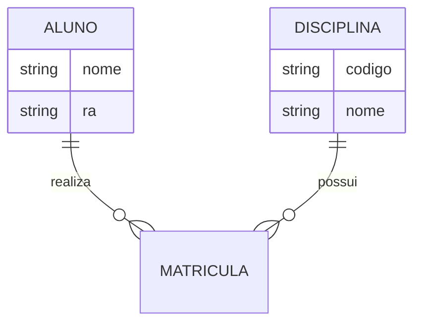

# Modelagem Entidade-Relacionamento

A modelagem ER é a base para a criação de bancos de dados relacionais robustos.

## Diagrama ER (Mermaid)



## Exemplo de SQL (DDL)

```sql
CREATE TABLE Aluno (
    ra VARCHAR(10) PRIMARY KEY,
    nome VARCHAR(100) NOT NULL
);

CREATE TABLE Disciplina (
    codigo VARCHAR(10) PRIMARY KEY,
    nome VARCHAR(100) NOT NULL
);
```
