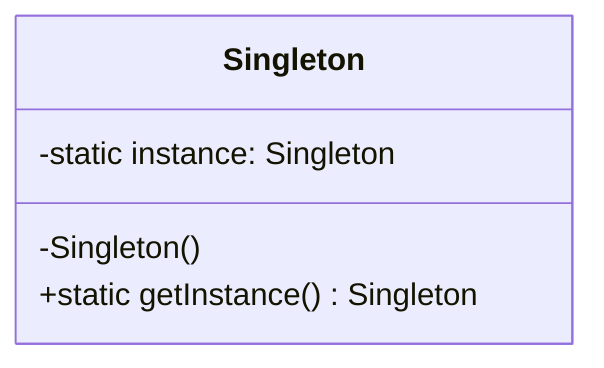

# Engenharia de Requisitos

Nesta aula, exploraremos a captura e modelagem de requisitos, além de padrões de projeto fundamentais.

## Diagrama de Classes UML (Mermaid)



## Padrão Singleton em Java

Abaixo está a implementação do padrão Singleton em Java:

```java
public class Singleton {
    private static Singleton instance;

    private Singleton() {}

    public static Singleton getInstance() {
        if (instance == null) {
            instance = new Singleton();
        }
        return instance;
    }
}
```
